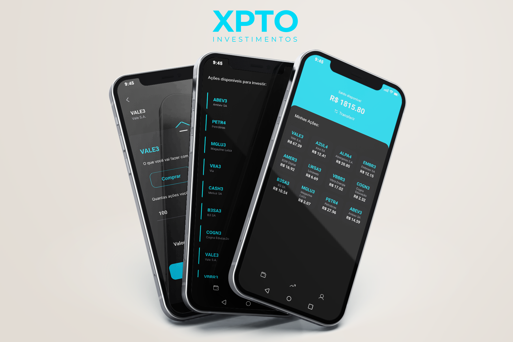
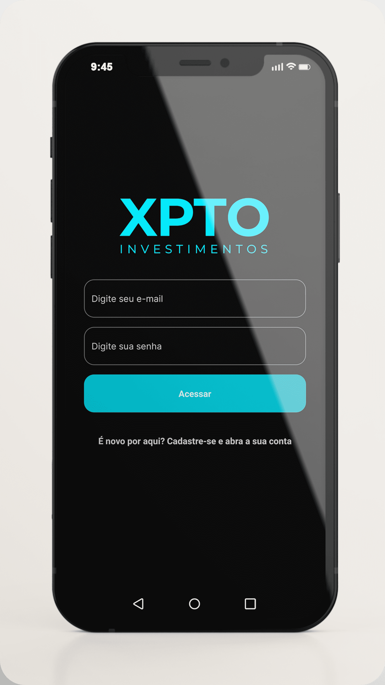
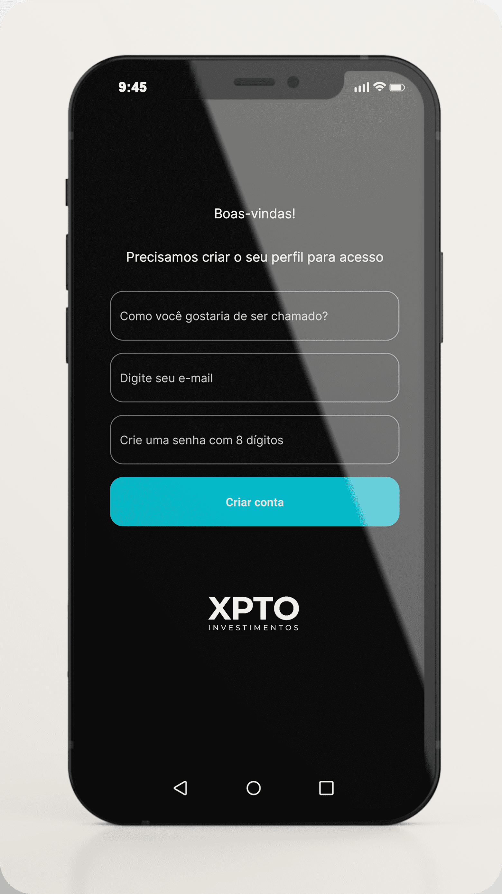
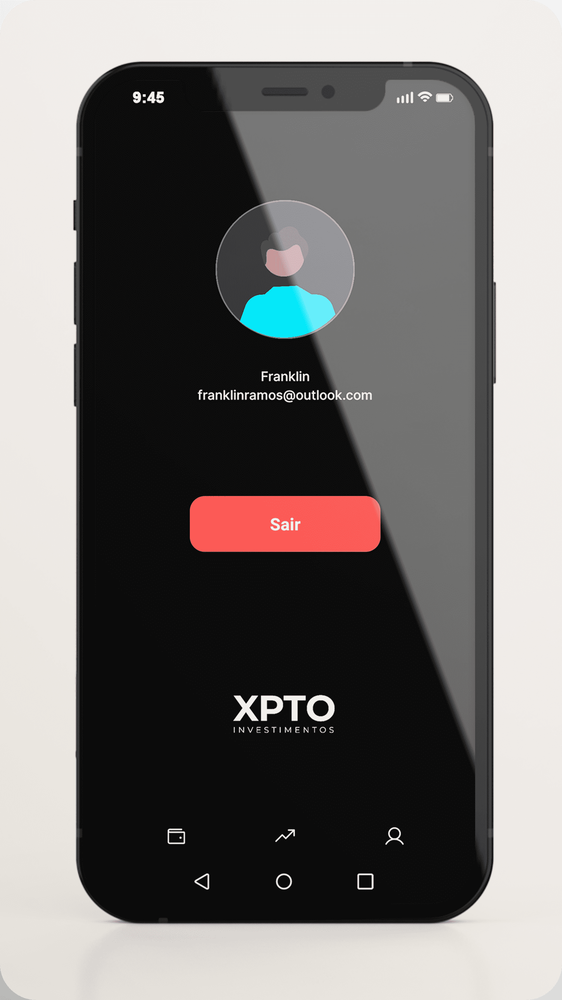
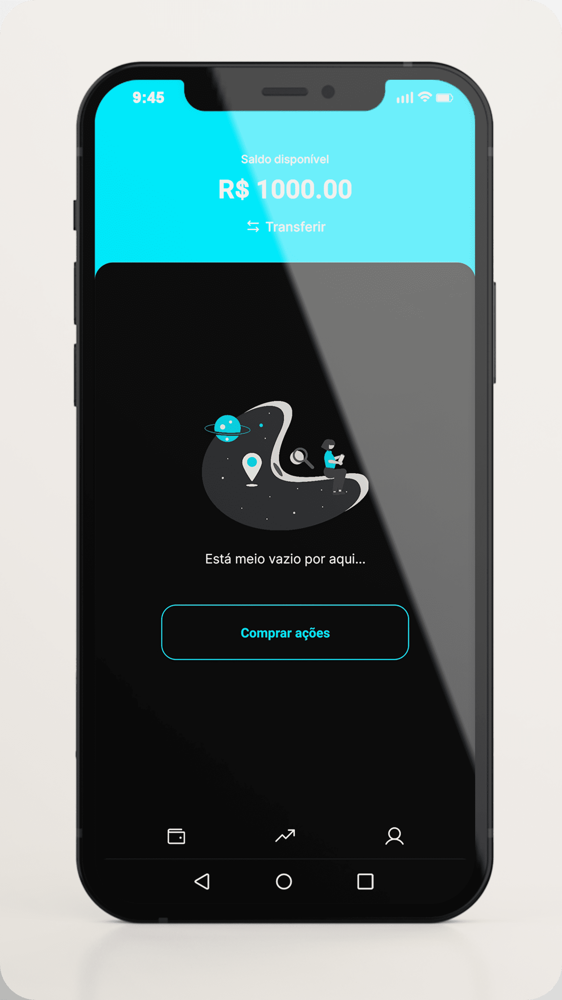
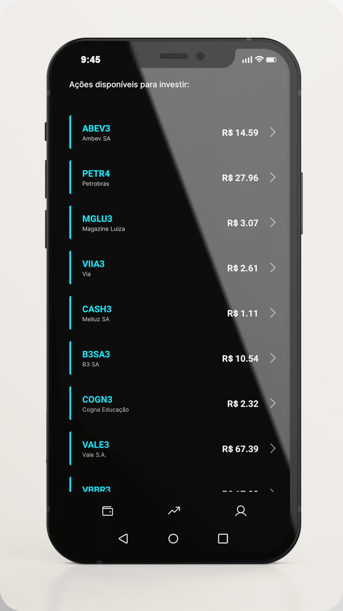
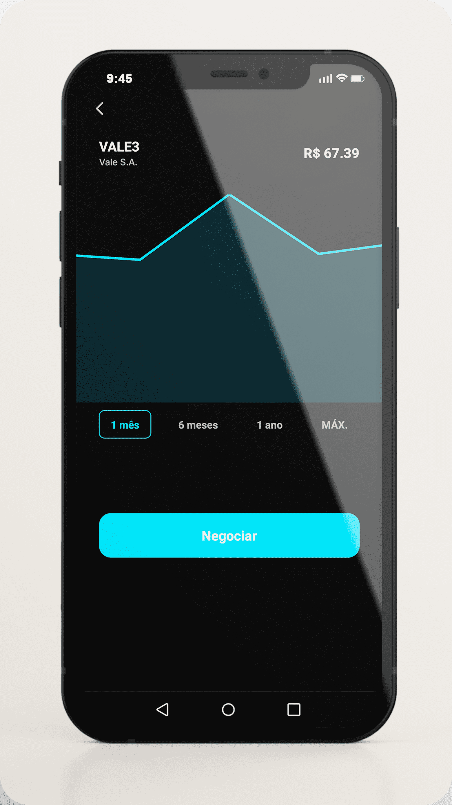
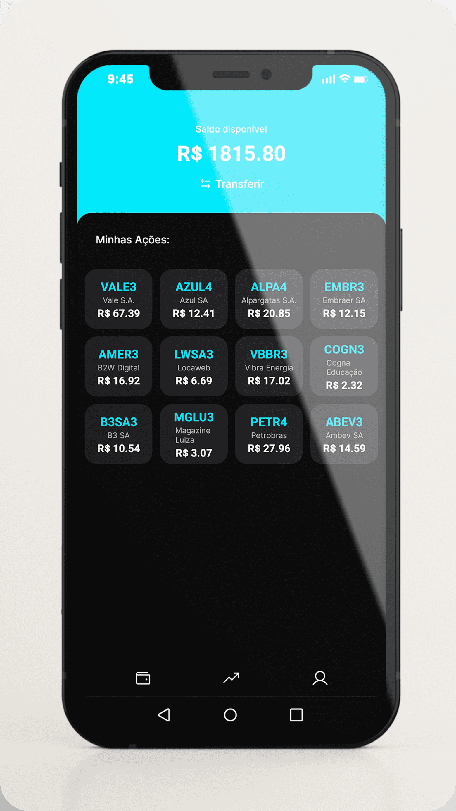

Aplicativo de investimento em ações, com algumas funcionalidades de conta digital.

## Técnologias usadas

- [React Native](https://reactnative.dev)
- [Expo](https://expo.dev)
- [React Navigation](https://reactnavigation.org)
- [Victory](https://formidable.com/open-source/victory/docs/native)

## Funcionalidades

- [x] Tela de login.
- [x] Tela de cadastro do usuário.
- [x] Tela de perfil do usuário.
- [x] Tela de saque e depósito.
- [x] Tela com todas as ações disponíveis.
- [x] Tela de detalhes de ação.
- [x] Tela de negociação de ações.
- [x] Armazenamento local de dados do usuário.

<div style="display:flex;justify-content:space-around;">
  
  
  
  
  
  
  
  
  
</div>

## Executando aplicação

<details>
  <summary>Para executar a aplicação é necessário ter o Expo instalado</summary>
  
  ### expo-cli
  
  O primeiro passo é se certificar de que você possui os requisitos necessários para executar a CLI do Expo no seu computador:
  
  - Node.js LTS
  - npm (ou Yarn)

  Com essas ferramentas, basta você instalar a CLI do Expo globalmente pelo npm (ou Yarn, o que você preferir):
  
  ```bash
  npm install -g expo-cli
  ```
  Para verificar se a instalação ocorreu com sucesso, execute: `expo --version`.
  
  ### Expo Go
  Com a CLI instalada no seu computador, você consegue executar o metro bundler para servir o seu código, mas para executar o app no seu celular você precisa instalar o aplicativo Expo Go. Ele é o responsável por pegar o código que o metro bundler envia e exibir em tela o seu app React Native. Para instalá-lo, basta buscar nas lojas o aplicativo <strong>Expo Go</strong>
</details>

<br>

```bash
cd mobile/
``` 
```bash
npm install
``` 
```
expo start
```

## Contato 
 
[](https://www.linkedin.com/in/franklinrms/) 
</div>
